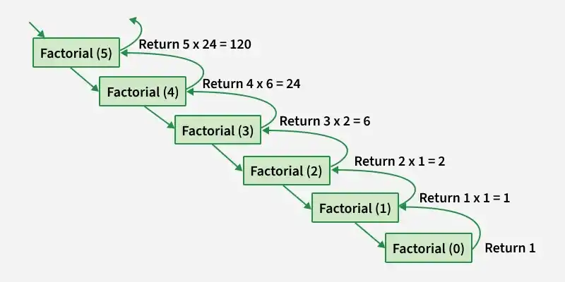

```java
class GFG {

    static int factorial(int n)
    {
        // Calculating factorial of number
        //base condition 
        if (n == 0 || n == 1)
            return 1;
       //recursive call
        return n * factorial(n - 1);
    }

    public static void main(String[] args)
    {
        int num = 5;
        System.out.println(factorial(num));
    }
}
```


Factorial trailing zeros
Given an integer n, return the number of trailing zeroes in n!.

Note that n! = n * (n - 1) * (n - 2) * ... * 3 * 2 * 1.
Brute force (not for large n)
```java
class Solution {
    public int trailingZeroes(int n) {
        int fact = 1;
        for (int i = 1; i <= n; i++) {
            fact *= i;
        }
        
        int count = 0;
        while (fact % 10 == 0) {
            count++;
            fact /= 10;
        }
        
        return count;
    }
}
```
Optimal(O(logn))
```java

class Solution {
    public int trailingZeroes(int n) {
        int count = 0;
        
        while (n > 0) {
            n /= 5;
            count += n;
        }
        
        return count;
    }
}
```
Recursive

```java
class Solution {
    public int trailingZeroes(int n) {
        if (n == 0) return 0;
        
        return n / 5 + trailingZeroes(n / 5);
    }
}
```

